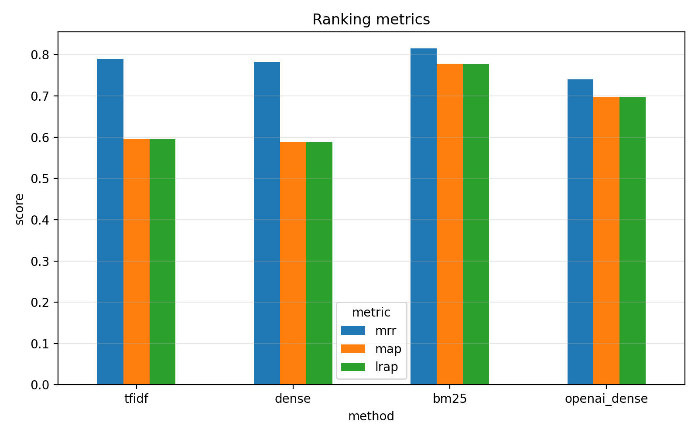
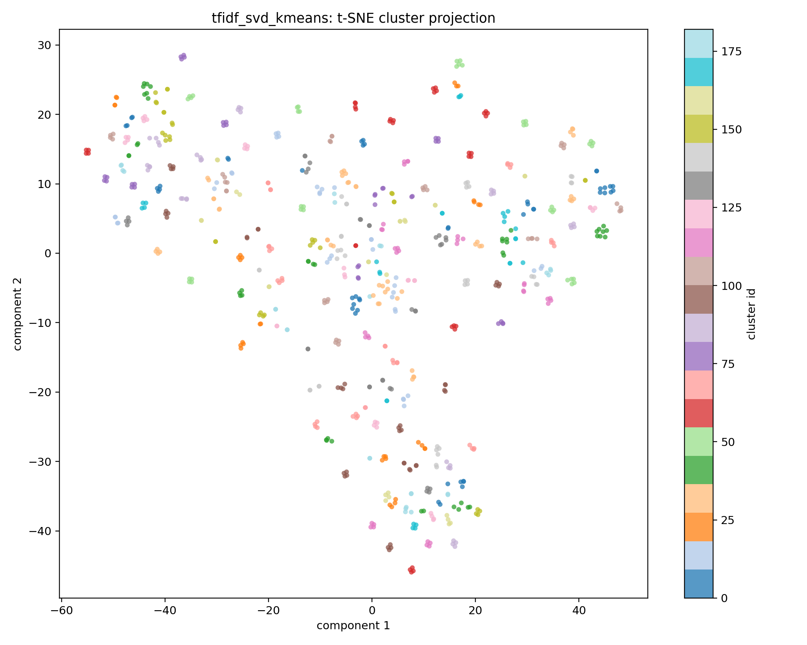
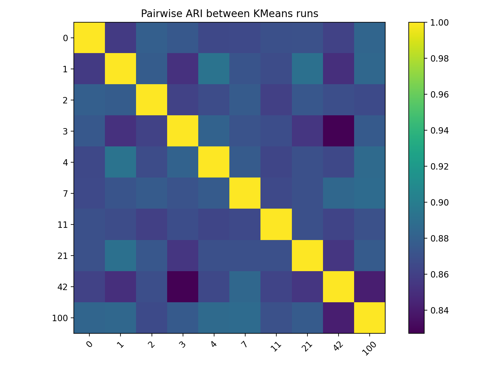
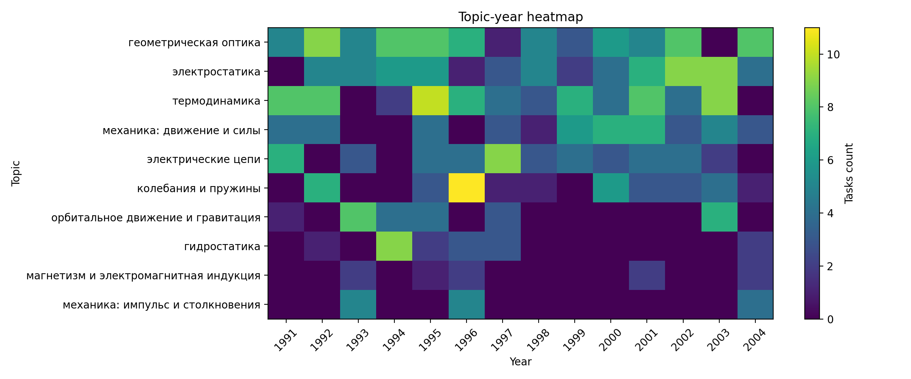

# olympflow-2.0: извлечение и анализ олимпиадных задач по физике

## 1. Постановка задачи

Цель проекта — построить воспроизводимый пайплайн для извлечения, структурирования и первичного анализа корпуса олимпиадных задач по физике из PDF-сборника.

Исходные данные представлены в неструктурированном виде: задачи находятся внутри PDF-книги, где текст, формулы, рисунки и номера задач не выделены как отдельные сущности. Поэтому первая часть работы связана с извлечением текста и сборкой датасета, а вторая — с анализом полученного корпуса через retrieval, embeddings и clustering.

Основные исследовательские вопросы:

- можно ли автоматически собрать task-level датасет олимпиадных задач из PDF;
- какие методы лучше находят похожие задачи: sparse lexical baselines или dense embeddings;
- насколько устойчивы полученные кластеры задач;
- можно ли автоматически интерпретировать кластеры;
- есть ли в корпусе повторяющиеся темы и временная динамика.

## 2. Данные и пайплайн

Основной источник данных — `phys_book.pdf`, страницы `2..177`. В текущей версии корпуса используется 176 страниц сборника. После OCR, разбиения текста и склейки задач был собран датасет из 728 задач. По извлечённым годам билетов корпус покрывает период примерно с 1991 по 2004 год.

Пайплайн проекта состоит из следующих этапов:

1. рендеринг страниц PDF в изображения;
2. OCR страниц через Mistral OCR;
3. разбиение OCR-текста на отдельные задачи;
4. склейка задач, продолжающихся между соседними страницами;
5. сборка финального task-level датасета;
6. построение grouped weak-labeled датасета;
7. построение retrieval baselines;
8. построение dense embeddings;
9. оценка retrieval-метрик;
10. кластеризация задач;
11. анализ устойчивости и интерпретация кластеров;
12. анализ временной динамики.

Финальный task-level датасет лежит в:

- `data/dataset/`

Grouped weak-labeled версия лежит в:

- `data/dataset_grouped/`

Grouped dataset используется как слабая разметка для retrieval и clustering evaluation. Weak labels построены по локальным группам задач внутри разделов. Это не ручная semantic gold-разметка, а приближённая pseudo-label постановка.

## 3. Методы retrieval

Для поиска похожих задач были проверены четыре подхода:

- TF-IDF;
- BM25;
- Mistral dense embeddings;
- OpenAI dense embeddings.

TF-IDF и BM25 являются sparse lexical baselines. Они опираются на совпадение слов, терминов, обозначений и формулировочных шаблонов.

Dense embeddings строятся через внешние API и сопоставляют каждой задаче плотный вектор фиксированной размерности. В проекте использовались Mistral embeddings и OpenAI embeddings. API-запросы выполняются асинхронно, батчами и с ограничением числа одновременных запросов.

Основные retrieval-артефакты лежат в:

- `data/features/tfidf/`
- `data/features/bm25/`
- `data/features/dense/`
- `data/features/openai_dense/`

Метрики лежат в:

- `data/metrics/`

## 4. Retrieval results

Итоговое сравнение retrieval-методов:

| method | precision@1 | precision@3 | precision@5 | precision@10 | recall@1 | recall@3 | recall@5 | recall@10 | MRR | MAP | LRAP |
|---|---:|---:|---:|---:|---:|---:|---:|---:|---:|---:|---:|
| TF-IDF | 0.701513 | 0.586887 | 0.375241 | 0.198487 | 0.234296 | 0.588262 | 0.626777 | 0.662999 | 0.789453 | 0.595507 | 0.595507 |
| Mistral dense | 0.693260 | 0.565337 | 0.370289 | 0.203301 | 0.231774 | 0.566713 | 0.618524 | 0.679046 | 0.783012 | 0.588709 | 0.588709 |
| BM25 | 0.726648 | 0.623626 | 0.398077 | 0.211126 | 0.332418 | 0.834478 | 0.891712 | 0.950549 | 0.815008 | 0.777160 | 0.777160 |
| OpenAI dense | 0.663462 | 0.511905 | 0.332143 | 0.183379 | 0.221841 | 0.513278 | 0.554945 | 0.612637 | 0.740361 | 0.697736 | 0.697736 |

Основной результат: BM25 оказался лучшим retrieval baseline на текущей weak-label постановке.

Наиболее сильный прирост виден по `recall@10`: BM25 достигает `0.950549`, тогда как TF-IDF даёт `0.662999`, Mistral dense — `0.679046`, OpenAI dense — `0.612637`.

Это показывает, что текущая weak-label постановка хорошо согласована с lexical similarity. Внутри локальных групп часто повторяются физические объекты, обозначения, численные параметры и формулировочные шаблоны. Sparse-методы хорошо используют эту структуру.

Dense embeddings не превзошли sparse baselines. При этом это не означает, что dense-представления бесполезны. Они могут находить содержательно похожие задачи из других weak-групп, но текущая evaluation protocol считает такие случаи ошибками.

Подробные отчёты:

- `reports/retrieval/retrieval_metrics_summary.md`
- `reports/retrieval/retrieval_comparison_summary.md`
- `reports/retrieval/error_analysis_bm25_wins_over_dense.md`
- `reports/retrieval/error_analysis_dense_wins_over_bm25.md`
- `reports/retrieval/error_analysis_all_fail.md`

## 5. Clustering experiments

Для кластеризации сравнивались dense и sparse представления.

Основные варианты:

- TF-IDF + KMeans;
- TF-IDF + Agglomerative Clustering;
- Mistral dense + KMeans;
- Mistral dense + Agglomerative Clustering;
- TF-IDF + SVD + KMeans;
- TF-IDF + SVD + Agglomerative Clustering.

Итоговое сравнение:

| method | n_clusters | ARI | NMI | homogeneity | completeness | V-measure | silhouette cosine |
|---|---:|---:|---:|---:|---:|---:|---:|
| tfidf_svd_kmeans | 183 | 0.623575 | 0.922664 | 0.918593 | 0.926772 | 0.922664 | 0.721749 |
| tfidf_svd_agglomerative | 183 | 0.605400 | 0.922042 | 0.915607 | 0.928567 | 0.922042 | 0.720988 |
| tfidf + agglomerative | 183 | 0.507817 | 0.907352 | 0.896951 | 0.917997 | 0.907352 | NA |
| dense_mistral + agglomerative | 183 | 0.539734 | 0.903987 | 0.898006 | 0.910048 | 0.903987 | NA |
| dense_mistral + kmeans | 183 | 0.486780 | 0.889802 | 0.881233 | 0.898540 | 0.889802 | NA |
| tfidf + kmeans | 183 | 0.485106 | 0.887302 | 0.880353 | 0.894362 | 0.887302 | NA |

Лучший clustering baseline — `tfidf_svd_kmeans`.

Этот результат согласуется с retrieval-экспериментами: если weak labels хорошо согласованы с лексической близостью, то sparse clustering тоже оказывается сильным.

Основные файлы:

- `reports/clustering/clustering_comparison.md`
- `data/clusters/sparse_clustering_summary.json`
- `data/clusters/tfidf_clustering/tfidf_svd_kmeans/`

Для кластеров также были построены 2D-визуализации через PCA и t-SNE. Эти графики не используются как строгая метрика качества, но помогают визуально проверить, образуют ли задачи отдельные локальные группы в пространстве признаков.

Основные файлы:

- `reports/clustering/tfidf_svd_kmeans_clusters_tsne.png`
- `reports/clustering/tfidf_svd_agglomerative_clusters_tsne.png`
- `reports/clustering/dense_agglomerative_clusters_tsne.png`
- `reports/clustering/cluster_2d_visualizations.md`

## 6. Устойчивость кластеризации

Для лучшего варианта `tfidf_svd_kmeans` была проведена проверка устойчивости. Смысл этой проверки простой: нужно понять, получились ли кластеры действительно из-за структуры данных, или это случайный результат одного конкретного запуска алгоритма.

KMeans зависит от случайной инициализации: если запустить его несколько раз с разными `random seed`, он может дать немного разные кластеры. Поэтому я сделал несколько повторных запусков `tfidf_svd_kmeans` с разными seed и сравнил получившиеся разбиения между собой.

Сравнение делалось через ARI и NMI. Эти метрики показывают, насколько похожи два разбиения объектов на кластеры. Если значения близки к 1, значит разные запуски дают почти одинаковую структуру кластеров.

Дополнительно я проверил устойчивость на подвыборках: брал случайные 85% задач, заново строил кластеризацию и сравнивал результат с исходным разбиением на пересечении объектов. Это нужно, чтобы проверить, не разваливается ли структура кластеров, если убрать часть данных.

Результаты:

| metric | value |
|---|---:|
| mean pairwise ARI | 0.873194 |
| mean pairwise NMI | 0.978900 |
| min pairwise ARI | 0.837930 |
| min pairwise NMI | 0.973036 |
| mean subsample ARI | 0.880546 |
| mean subsample NMI | 0.980707 |

Вывод: кластеризация достаточно стабильна. Разные запуски KMeans дают близкие разбиения, а при удалении части объектов структура кластеров в целом сохраняется. Значит, полученные кластеры не выглядят случайным артефактом одного запуска.

Основные файлы:

- `reports/clustering/cluster_consistency_summary.md`
- `reports/clustering/cluster_consistency_ari_heatmap.png`
- `reports/clustering/cluster_consistency_nmi_heatmap.png`

## 7. Анализ качества кластеров

Дополнительно был проведён анализ кластеров размера `>= 4`.

Идея анализа:

- для кластеров размера `4` проверить, насколько часто задачи относятся к одному году;
- для кластеров размера `> 4` посмотреть распределение годов, разделов и weak-групп;
- выделить suspicious/flagged clusters для ручной проверки.

Результаты:

| method | records | clusters | clusters size >= 4 | flagged clusters | largest cluster |
|---|---:|---:|---:|---:|---:|
| dense_agglomerative | 728 | 183 | 135 | 16 | 9 |
| tfidf_svd_kmeans | 728 | 183 | 144 | 5 | 10 |
| tfidf_svd_agglomerative | 728 | 183 | 140 | 6 | 10 |

`tfidf_svd_kmeans` выглядит наиболее аккуратно: у него меньше flagged clusters, чем у dense agglomerative и TF-IDF SVD agglomerative.

Важно, что flagged cluster не означает автоматически плохой кластер. Это только сигнал, что кластер стоит проверить вручную.

Основные файлы:

- `reports/clustering/cluster_quality_analysis.md`
- `reports/clustering/dense_agglomerative_cluster_quality_analysis.md`
- `reports/clustering/tfidf_svd_kmeans_cluster_quality_analysis.md`
- `reports/clustering/tfidf_svd_agglomerative_cluster_quality_analysis.md`

## 8. Временная динамика на уровне тем

Так как отдельные кластеры небольшие, был проведён дополнительный анализ временной динамики на уровне тем. Вместо анализа отдельных кластеров задачи агрегировались по автоматически интерпретированным темам из `tfidf_svd_kmeans`.

Темы здесь не задавались вручную и не брались из готовой разметки. Они получены автоматически как интерпретация кластеров `tfidf_svd_kmeans`. Для каждого кластера доставались наиболее характерные TF-IDF слова и биграммы, после чего по набору таких ключевых терминов кластеру присваивалась примерная физическая тема. Например, слова `линза`, `фокус`, `изображение`, `пучок света` дают тему геометрической оптики, а слова `газ`, `температура`, `давление`, `моль` дают тему термодинамики. Если набор ключевых слов был недостаточно понятным, кластер получал техническую метку `неоднозначная тема`.

Поэтому временная динамика на уровне тем — это не ручная экспертная классификация, а разведочный анализ поверх автоматически интерпретированных кластеров.

| topic | tasks | clusters | years | first year | last year | span | pattern |
|---|---:|---:|---:|---:|---:|---:|---|
| геометрическая оптика | 104 | 26 | 13 | 1991 | 2004 | 13 | long_term_recurring |
| электростатика | 95 | 24 | 13 | 1992 | 2004 | 12 | long_term_recurring |
| термодинамика | 89 | 22 | 12 | 1991 | 2003 | 12 | long_term_recurring |
| механика: движение и силы | 68 | 17 | 11 | 1991 | 2004 | 13 | long_term_recurring |
| электрические цепи | 54 | 15 | 11 | 1991 | 2003 | 12 | long_term_recurring |
| колебания и пружины | 44 | 11 | 10 | 1992 | 2004 | 12 | long_term_recurring |
| орбитальное движение и гравитация | 31 | 9 | 6 | 1991 | 2003 | 12 | long_term_recurring |
| гидростатика | 25 | 7 | 6 | 1992 | 2004 | 12 | long_term_recurring |
| магнетизм и электромагнитная индукция | 16 | 5 | 5 | 1993 | 2004 | 11 | recurring |
| механика: импульс и столкновения | 14 | 4 | 3 | 1993 | 2004 | 11 | multi_year |

Главный вывод: на уровне тем повторяемость хорошо проявляется. Оптика, электростатика, термодинамика, механика, электрические цепи, колебания и гравитационные задачи возвращаются на протяжении большого промежутка лет.

Это означает, что корпус имеет выраженную долгосрочную тематическую структуру: конкретные формулировки и локальные шаблоны меняются, но крупные физические темы регулярно возвращаются.

Основные файлы:

- `reports/clustering/topic_temporal_dynamics.md`
- `reports/clustering/topic_year_coverage.png`
- `reports/clustering/topic_year_heatmap.png`
- `data/clusters/temporal_dynamics/topic_temporal_dynamics.json`

## 9. Автоматическая интерпретация кластеров

Для лучшего clustering baseline была добавлена автоматическая интерпретация кластеров.

Для каждого кластера сохраняются:

- top TF-IDF terms;
- предполагаемая тема;
- weak-group распределение;
- типичные задачи, ближайшие к центроиду кластера.

Примеры автоматически найденных тем:

- геометрическая оптика;
- электростатика;
- термодинамика;
- электрические цепи;
- колебания и пружины;
- орбитальное движение и гравитация;
- гидростатика.

Эта интерпретация не является ручной экспертной разметкой, но она помогает быстро понять, что лежит внутри кластеров.

Основные файлы:

- `reports/clustering/cluster_interpretation.md`
- `data/clusters/tfidf_clustering/tfidf_svd_kmeans/cluster_interpretation.json`

## 10. Итоговые выводы

Главный результат проекта: удалось построить воспроизводимый пайплайн от PDF-сборника до датасета, retrieval baselines, clustering experiments и анализа временной динамики.

Основные выводы:

1. BM25 является лучшим retrieval baseline на текущей weak-label постановке.
2. TF-IDF + SVD + KMeans является лучшим clustering baseline.
3. Sparse-подходы лучше согласуются с текущими weak labels, чем dense embeddings.
4. OpenAI dense embeddings не изменили общую картину и не превзошли sparse baselines.
5. Кластеризация `tfidf_svd_kmeans` устойчива к random seed и подвыборкам.
6. Cluster quality analysis показывает, что `tfidf_svd_kmeans` даёт меньше flagged clusters, чем dense agglomerative.
7. На уровне отдельных кластеров строгая периодичность почти не видна.
8. На уровне тем долгосрочная повторяемость хорошо проявляется: многие физические темы возвращаются в течение большого интервала лет.
9. Проект можно использовать как основу для дальнейшего анализа олимпиадных задач, поиска похожих задач и изучения тематических паттернов.

## 11. Итоговые выводы

Главный результат проекта: удалось построить воспроизводимый пайплайн от PDF-сборника до датасета, retrieval baselines, экспериментов по кластеризации, интерпретации кластеров и анализа временной динамики.

По исследовательским вопросам получились следующие ответы.
1. Автоматически собрать task-level датасет олимпиадных задач из PDF возможно. В текущей версии из 176 страниц сборника был собран датасет из 728 задач за период примерно 1991–2004 годов.
2. На текущей weak-label постановке лучше всего похожие задачи находит BM25. Он оказался сильнее TF-IDF, Mistral dense embeddings и OpenAI dense embeddings по основным retrieval-метрикам.
3. Sparse-подходы лучше согласуются с текущими weak labels, чем dense embeddings. Это не означает, что dense embeddings хуже для смыслового поиска вообще; скорее текущая weak-разметка сильнее поощряет лексическую похожесть.
4. Лучший clustering baseline — TF-IDF + SVD + KMeans. Он лучше всего согласуется со слабой разметкой среди проверенных вариантов.
5. Полученные кластеры достаточно устойчивы. Проверка на разных random seed и случайных подвыборках показала, что структура кластеров в целом сохраняется.
6. Кластеры можно автоматически интерпретировать через top TF-IDF terms. Такая интерпретация не является ручной экспертной разметкой, но позволяет быстро понять основные физические темы внутри кластеров.
7. На уровне отдельных кластеров строгая периодичность почти не видна, потому что кластеры маленькие. Но на уровне автоматически интерпретированных тем долгосрочная повторяемость хорошо проявляется: оптика, электростатика, термодинамика, механика, электрические цепи, колебания и гравитационные задачи возвращаются в разные годы.
8. Проект можно использовать как основу для дальнейшего анализа олимпиадных задач, поиска похожих задач и изучения тематических паттернов.
